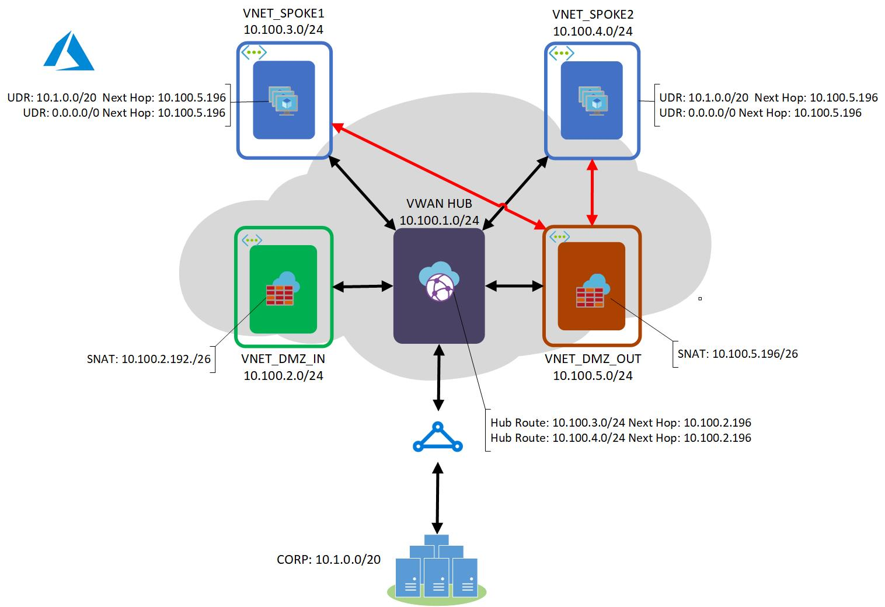

# azure_vwan_dmz
Azure VWAN implementation with DMZs for firewalling traffic from onprem and to the internet.

# Authors
**Design/Image**: [Bryan Woodworth](https://www.linkedin.com/in/bryan-woodworth-4a9aa39/) -- Azure Global Black Belt  
**Scripting**: [Mike Hellrich](https://www.linkedin.com/in/michaelhellrich/) -- Cloud Solution Architect

# Files
[vwanscript.sh | Azure CLI implementation](vwanscript.sh)  
[Terraform implementation -- work in progress](hub.tf)
